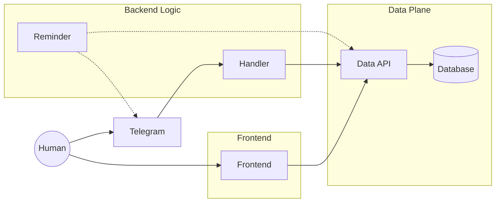

# Architecture

## Schema

## Technologies

### Frontend

- [Svelte](https://svelte.dev/) as web javascript framework.
- [Materialize](http://materializecss.com/) as CSS framework.

### Backend

- [Python](https://www.python.org/) as programming language.
  - [FastAPI](https://fastapi.tiangolo.com/) as both API framework and logic programming language.

### Data

- [InfluxDB](https://www.influxdata.com/products/influxdb-overview/) as time-series database.
