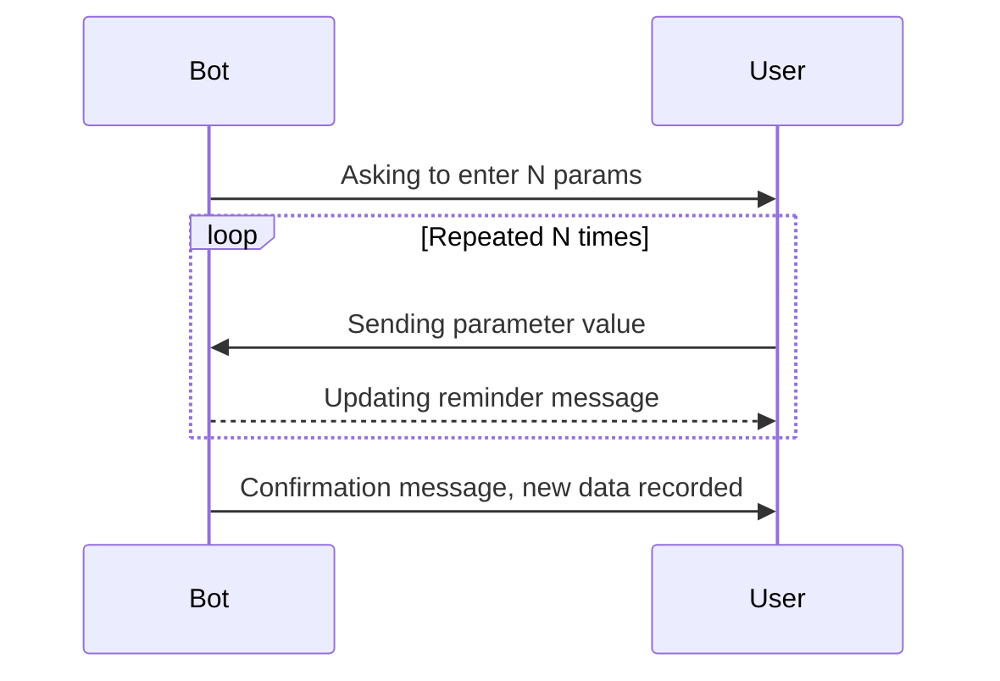
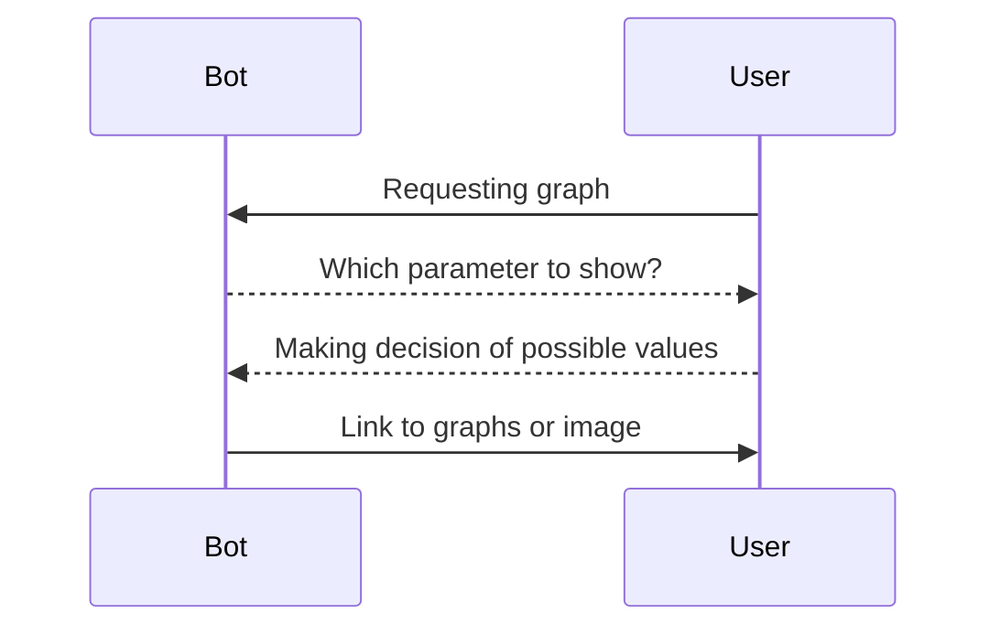

# Dialogues

### Weekly reminder

```mermaid
sequenceDiagram
  participant B as Bot
  participant U as User

  B ->> U: Asking to enter N params

  loop Repeated N times
    U ->> B: Sending parameter value
    B -->> U: Updating reminder message
  end

  B ->> U: Confirmation message, new data recorded
```

### Graphs request

```mermaid
sequenceDiagram
  participant B as Bot
  participant U as User

  U ->> B: Requesting graph
  B -->> U: Which parameter to show?
  U -->> B: Making decision of possible values
  B ->> U: Link to graphs or image
```
